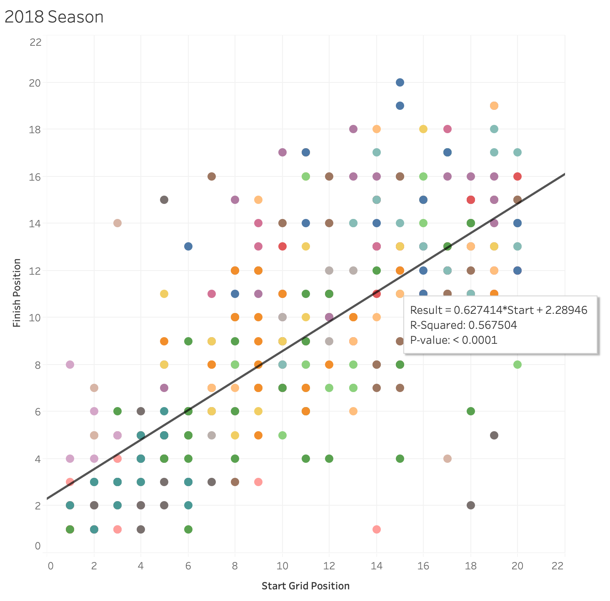
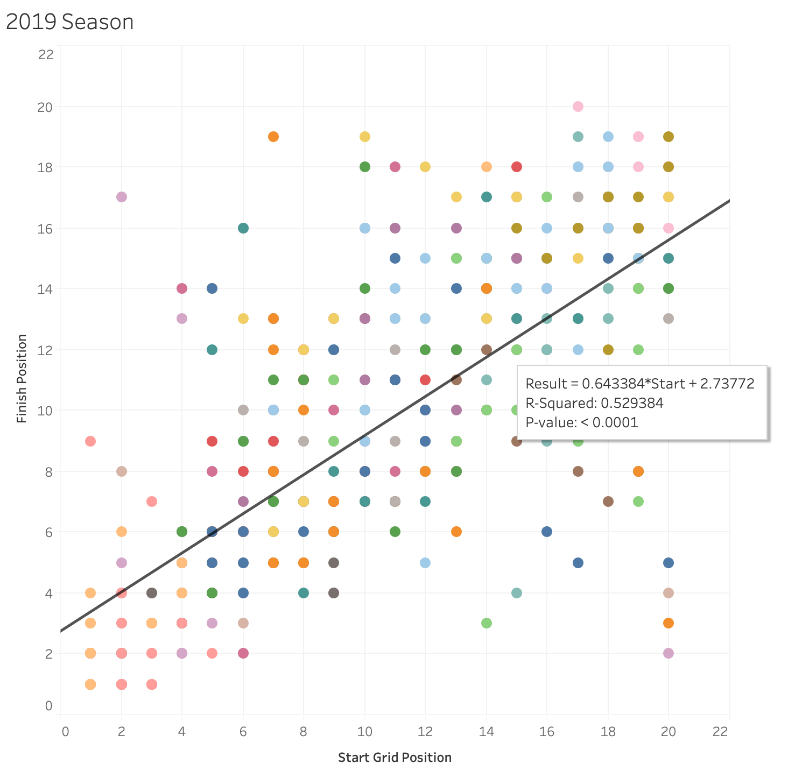
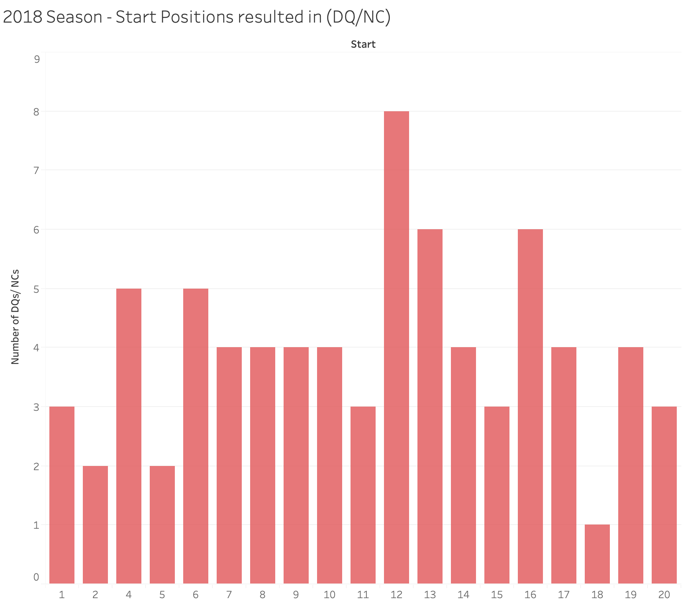
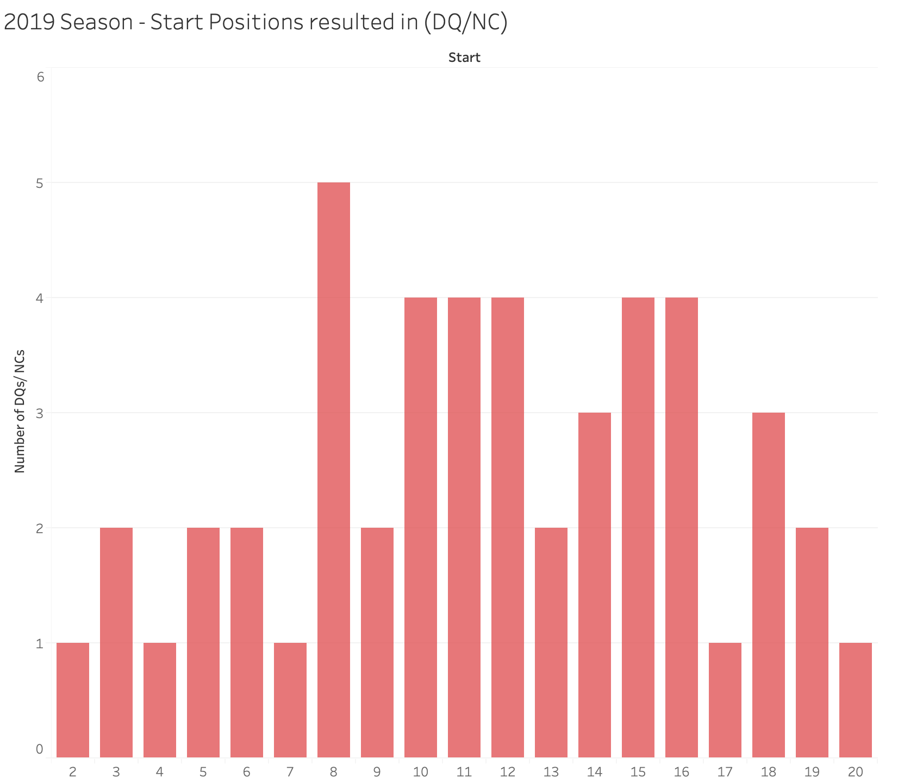
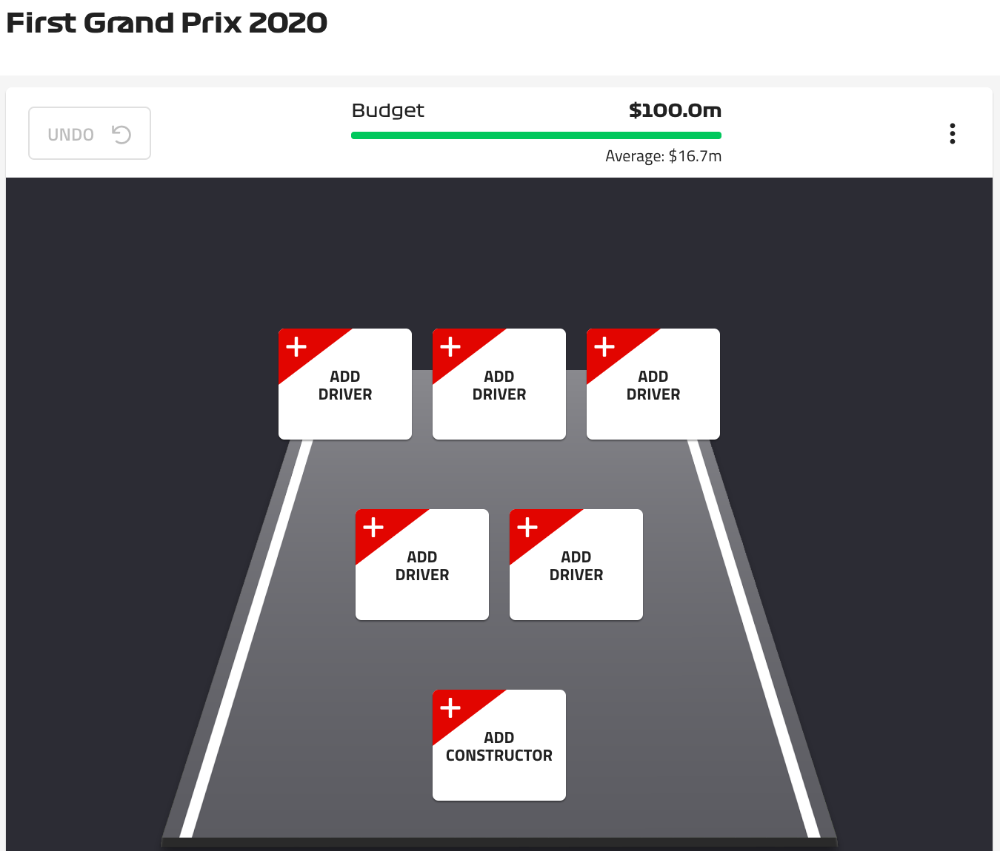
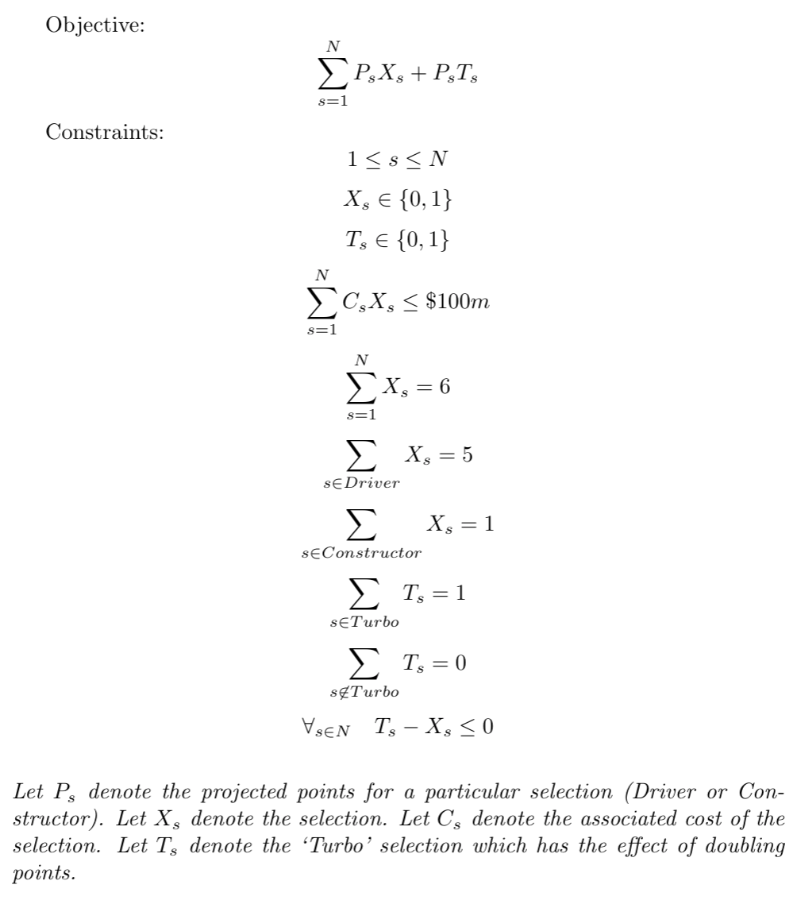
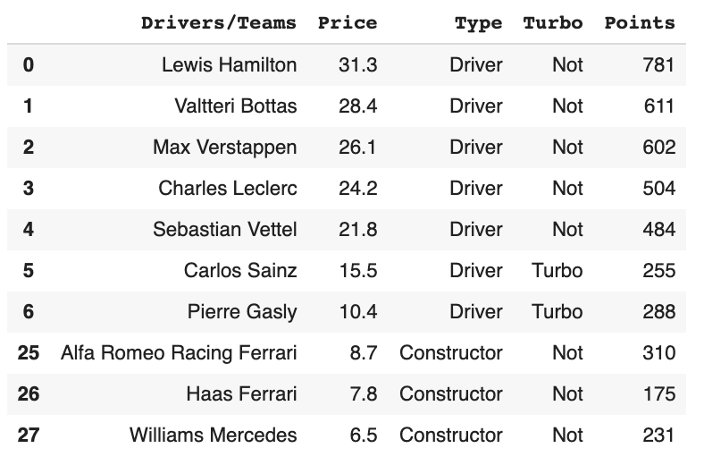
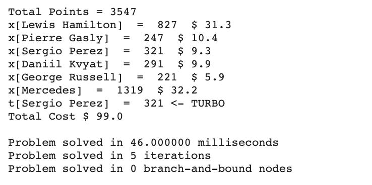

# F1 Fantasy 2020

### Table of Contents: 
* [Basics of Formula 1](#Basics-of-Formula-1)
* [F1 Fantasy Rules](#F1-Fantasy-Rules)
* [F1 Fantasy Points](#F1-Fantasy-Points)
* [Optimization Problem](#Optimization-Problem)
* [Python Notebook](#Python-Notebook)

## Basics of Formula 1:
In case you are new to F1 like myself -- having only watched the [Netflix series](https://www.netflix.com/title/80204890) -- F1 is has a relatively small field for each race. Qualifying occurs in a three-stage "knockout" system. During stages all drivers who have not yet been eleminated are on the track try to set the fastest lap time. This process sets the starting grid for the race which is typically held on Sunday. 

Each team a.k.a constructor has two race car drivers. The top 10 drivers in Sunday's race score points (25,18,15,12,10,8,6,4,2,1) plus the driver who has the fastest lap gets 1 point. For example, if the two Mercedes drivers (Lewis Hamilton & Valtteri Bottas) place first and third plus Bottas has the fastest lap then Mercedes scores 25 + 15 + 1 = 41 points in pursuit of the **Constructors World Championship**. But Hamilton would have scored 25 - 16 = 9 points more than Bottas in pursuit of the **Drivers World Championship**. Hence teammate rivalries can be fierce in F1. 

Fantasy points are a little more complex which is detailed in a later section. A few preliminary questions I had when watching...  

**Question:** How does a driver's start position affect his finish position? 

<p align="center">
  
  
</p>

**Question:** Since only the top 10 drivers score, are drivers that start outside top 10 less likely to finish? (NC = Not Classified, DQ = Disqualification)

<p align="center">
  
  
</p>


## F1 Fantasy Rules:
<p align="center">
  
</p>

1) Pick a team of 5 drivers and 1 constructor from a $100m budget. 
2) You must also select a Turbo Driver for each race who will score double points.
3) Only drivers priced at under $20m can be selected as your Turbo Driver.

Extra: 

* There are no restrictions on how many drivers can be used from a particular team.
* Turbo driver can be different for each race, but must be selected prior to saving your team and doesn't count as a substitution. If your Turbo Driver's price increases to above $20m after you have selected them as your Turbo Driver you can keep them as your Turbo Driver.
* You also have two Mega Driver plays per season which multiplies the points scored by the selected driver by 3x. 

For the details see [fantasy rules](https://fantasy.formula1.com/game-rules).

## F1 Fantasy Points:
The fantasy points system is complex. Each race your 5 **Drivers** and 1 **Constructor** score points during qualifying session and Sunday's race. **Constructor** points are usually calculated by adding together their two driver's points. Streak points are also give out for consistent performance across 3 and/or 5 races in a row.

For the details see [fantasy points](https://fantasy.formula1.com/points-scoring). 

## Optimization Problem:
**Mathematical Formulation:**
* The goal is to maximize the weekly total number of points of our team. 
* For all drivers and constructors we assign a binary decision of selected (X_s = 1) or not selected (X_s = 0). 
* Turbo upgrade we assign a binary decision of selected (T_s = 1) or not selected (T_s = 0).
* The cost of selections must be under 100 million.  
* A team must have exactly 5 drivers and 1 constructor.
* Assign one Turbo upgrade for eligible selections a.k.a (drivers under 20 million). 
* Assign zero Turbo upgrades for non-eligible selections a.k.a (drivers over 20 million and constructors). 
* Turbo upgrade must be assigned to one of 5 selected drivers. **Hence for all (T_s - X_s =< 0)**
  * T_s = 0, X_s = 1 **allowed** meaning selected as driver and not given Turbo upgrade
  * T_s = 0, X_s = 0 **allowed** meaning not selected as driver and not given Turbo upgrade
  * T_s = 1, X_s = 1 **allowed** meaning selected as driver and given Turbo upgrade
  * T_s = 1, X_s = 0 **not allowed** meaning not selected as driver and given Turbo upgrade 
<p align="center">
  
</p>

**OR-Tools Implementation:**

* Use [Google OR-Tools](https://developers.google.com/optimization/mip/integer_opt) mixed integer programming (MIP) to solve.
* Note implementation differ slightly from mathematical formulation.
* Input data is in the from of pandas dataframe. **Example of data variable:**
<p align="center">
  
</p>

```python
from __future__ import print_function
from ortools.linear_solver import pywraplp

def main():
  ## Create Data:
  data = assign_Points(year, Fantasy_Data, Season_Points, theta = "sum", nLast_races = None, add_random = True)
  solver = pywraplp.Solver('simple_mip_program',
                            pywraplp.Solver.CBC_MIXED_INTEGER_PROGRAMMING)
  ## Create Varibles: 
  x = {}
  L = data.shape[0]
  turbo_map = {}
  for j in range(data.shape[0]):
    x[j] = solver.IntVar(0, 1, 'x[%s]' % data["Drivers/Teams"][j])
    if data["Turbo"][j] == "Turbo":
      x[L] = solver.IntVar(0, 1, 't[%s]' % data["Drivers/Teams"][j])
      turbo_map[L] = j 
      L += 1
  
  ## Cost Constraint (< 100m):
  constraint_expr = [data["Price"][j] * x[j] for j in range(data.shape[0])]
  solver.Add(sum(constraint_expr) <= 100.0)
  
  ## Amount Constraint (6 selections):
  constraint_expr = [x[j] for j in range(data.shape[0])]
  solver.Add(sum(constraint_expr) <= 6)

  drivers, constructors = [], []
  for j in range(data.shape[0]):
    if data["Type"][j] == "Driver":
      drivers.append(x[j])
    elif data["Type"][j] == "Constructor":
      constructors.append(x[j])
    else:
      print("ERROR: Seat is either driver or constructor.")
  
  ## Composition Constraint (5 drivers & 1 contructor):
  solver.Add(sum(drivers) == 5)
  solver.Add(sum(constructors) == 1)

  ## Turbo Constraint (only 1 driver):
  constraint_expr = [x[j] for j in range(L-len(turbo_map),L)]
  solver.Add(sum(constraint_expr) <= 1)

  ## Turbo Constraint (Turbo driver must be one of the 5 drivers):
  for t in turbo_map:
    solver.Add(x[t] - x[turbo_map[t]]  <= 0)

  ## Objective:
  objective = solver.Objective()
  for j in range(L):
    if j < data.shape[0]:
      objective.SetCoefficient(x[j], float(data['Points'][j]))
    else:
      objective.SetCoefficient(x[j], float(data['Points'][turbo_map[j]]))
  objective.SetMaximization()
  
  status = solver.Solve()
```

**Example of Solved Output:**
<p align="center">
  
</p>

## Python Notebook:

* **F1 Team Selection.ipynb**(https://github.com/longenbach/F1_Fantasy/blob/master/F1%20Team%20Selection.ipynb)
  * Webscrape historical data from F1 website
  * Format historical data into pandas dataframes
  * Score historical data based Fantasy rules
  * Google OR-Tools to optimally select team
